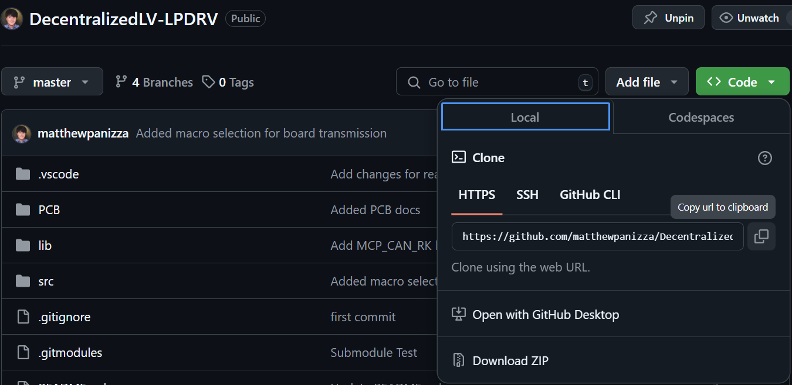
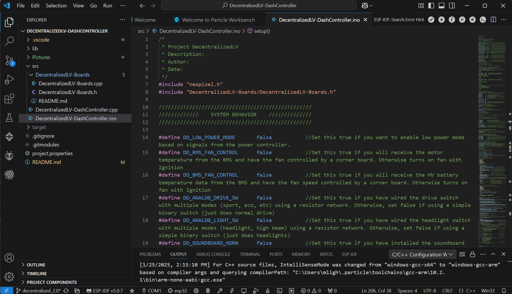
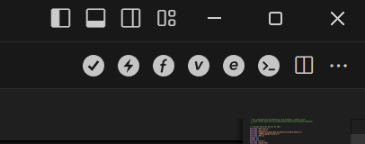

# DecentralizedLV-Documentation
Documentation about how the Decentralized Low Voltage System works and how to set up your computer for development. This README will also serve as a guide for students looking to get started with programming microcontrollers.

## Background

The Decentralized Low Voltage (DecentralizedLV) System is a series of CAN Bus equipped microcontrollers for powering accessory (12-Volt) components using fewer wires. The system takes input from the driver and other instrumentation and transmits it out on the CAN Bus. That data can then be decoded on other PCBs in the system to control power to components in other parts of the car. The various PCBs in the system have specialized functionality, but can all transmit and receive data, so information can be passed from one place in the vehicle to any other part very easily - hence the name "Decentralized".

## Table of Contents

 - **[Hardware Fundamental Concepts](#hardware-fundamental-concepts)**: Information about common hardware elements used on the DecentralizedLV boards and how they connect to microcontrollers
 - **[CAN Bus Fundamental Concepts](#can-bus-fundamental-concepts)**: Information about CAN Bus communication and encoding/decoding of messages
 - **[Setting Up the Development Environment](#setting-up-the-development-environment)**: Information about hwo to install Visual Studio Code and upload code to the microcontrollers used in the DecentralizedLV system
 - **[Software Architecture](#software-architecture)**: Information about common software practices used in the programming of the boards and quick links to get you started on understanding the microcontroller functions.
 - **[Simulation with the CAN Analyzer](#simulation-with-the-can-analyzer)**: Information about using the CAN Analyzer to control boards by emulating others
 - **[Boards API](#boards-api)**: Information about the Boards API, a module to standardize CAN communication between PCBs
 - **[Board Models](#board-models)**: Descriptions of each of the different boards used in the DecentralizedLV system
 - **[Low Voltage System Layouts](#low-voltage-system-layouts)**: Schematics of the electrical systems in the vehicle for SPX, SPX with DecentralizedLV and Car 2.0

## Hardware Fundamental Concepts

Each of the PCBs in the DecentralizedLV system has a specialized mix of hardware elements to perform vehicle functions, however they all have shared types.

### **Sense Pins**: Read binary (on/off) switches or 12V signals

Sense pins are meant to take a switch input from the driver or to read if a signal is high (12V) or low (0V). This measurement is done using the microcontroller's General Purpose Input Output (GPIO) functionality. Most microcontrollers operate using 3.3V logic, so the sense pins on the DecentralizedLV System use a voltage divider to step the voltage down. The voltage dividers we use have the following circuit:


When 12V is supplied to the input of the voltage divider, some current flows to ground through the resistors. The two resistor values can be tuned to select the ratio of voltage reduction, in our case, we use 4:1, since we want 3V when 12V is supplied. The voltage drop across each resistor is shown in the diagram.

With the hardware connected to the microcontroller, you can read back the status of the sensed signal using the `digitalRead()` function in software. You need to first initialize the GPIO to read as an input using the `pinMode()` function.

```cpp
#define MYPIN_NUMBER    D0  //Microcontroller pin the voltage divider output is connected to
bool myPinSense;

void setup(){   //Run once on startup
    pinMode(MYPIN_NUMBER, INPUT);     //Set GPIO to be an input
}

void loop(){    //Continuously executes
    myPinSense = digitalRead(MYPIN_NUMBER);   //Read the state of the input signal
    if(myPinSense){     //If myPinSense is true
        //Do something when the button is pressed!
    }
}
```

With the signal read into a boolean, you can do actions based on whether or not the signal is active. These sense pins are used primarily to sense inputs from the driver using switches (such as on the DecentralizedLV DashController), but they can also be used to sense 12V signals from equipment such as the Battery Management System.

**Important Note**: Voltage dividers should not be used as a power source (i.e. to reduce 12V to 3.3V to power a microcontroller). Voltage dividers should only be used for signals. Use a voltage *regulator* instead for supplying power to devices.

### **Low-Power Output Pins**: Supply power to low-power devices (less than 5 Amps)

Low-power outputs are designed to power devices such as headlights, tail lights, turn signals, stereos and other smaller electronics. On the DecentralizedLV boards, these outputs are switched on and off using MOSFETs. The Decentralized 1.0 boards (Sense and LPDRV) use N-Channel MOSFETs which switch to ground, while the Decentralized 2.0 boards (ULPDRV, Power Controller, HVController) use P-Channel MOSFETs which switch to the battery connection.


The N-Channel MOSFETs are easier to use from a component standpoint as the gate is driven high to turn it on, but the P-Channel MOSFET circuit is a better design as ground is a more common signal.

One advantage of MOSFETs over other switching components (such as relays) is that they have the average output voltage varied. On microcontrollers, this is done using PWM, which is supported on some microcontroller pins. See the datasheets for the Photon or P2 for which pins support PWM.


The Low-power Output pins can be driven using either the ```digitalWrite()``` for normal binary GPIO operation, or ```analogWrite()``` for PWM operation. ```analogWrite()``` takes an integer 0-255 as an argument to specify the duty cycle (% of time the signal is high).


### **High-Power Output Pins**: Supply power to high-power devices (greater than 5 Amps)

High-power outputs are designed to power devices requiring more power, including pumps, fans, and motor controller. These outputs use relays to do switching instead of MOSFETs, which does have the downside of no variation in output via PWM. The downside of relays is that they generally require a larger PCB footprint for transmitting the same amount of power compared to a MOSFET.


The High-power Output pins can be driven using either the ```digitalWrite()```


### **Analog Sense Pins**: Read voltage level of a signal

Analog sense pins work similarly to the normal binary sense pins, but are meant for measuring voltage with greater precision. On Particle platforms, a 14-bit (0-4095) analog to digital conversion (ADC) is done. A value of 4095 indicates 3.30V are present on the read pin, 0 indicates 0V, and the values scale linearly. If the voltage divider is configured with a 4:1 ratio (example in regular sense pin section), then the pin could measure a voltage between 0V (0) and 13.20V (4095). For sensing the exact voltage of a 12V signal, it is recommended to use a 5:1 voltage divider as this would have a maximum of 16.50V. 

```cpp
#define MYPIN_NUMBER    A0      //Microcontroller pin the voltage divider output is connected to
#define DIVIDER_RATIO   4.0     //Ratio of the voltage divider
#define ADC_MAX_V       3.3     //Voltage at which the ADC reads its max value
#define ADC_MAX         4095    //Maximum value the ADC can read
uint16_t analogMeasurement;
float voltage;

void setup(){   //Run once on startup
    pinMode(MYPIN_NUMBER, INPUT);     //Set as input to use ADC
}

void loop(){    //Continuously executes
    analogMeasurement = analogRead(MYPIN_NUMBER);                       //Read the voltage on the pin. Returns 0-4095
    voltage = DIVIDER_RATIO * ADC_MAX_V * analogMeasurement / ADC_MAX;  //Convert raw ADC reading to voltage
}
```

### **Voltage Regulators**: Voltage step-down circuits for powering microcontrollers from 12V

Another important component on the DecentralizedLV boards are voltage regulation circuits. The microcontrollers used on these boards either take 5V (in the case of the VIN pin on the Photon) or take 3.3V (in the case of the P2). Since the DecentralizedLV boards are powered directly off the battery voltage (12V), a regulator is necessary to not have the microcontroller produce magic smoke. There are two main flavors of DC-DC voltage regulators: Low-Dropout (LDO) and Switching-Mode (Buck Conversion). 

LDO regulators are the most simple to use, as they don't require many external components, but are not very efficient as they act like a variable resistor to have the voltage step down. Here is a schematic for using an LDO - this is the design used on the LPDRV boards. It has capacitors on both the inputs and outputs to stabilize the voltage when there are current spikes.


Switching-mode voltage regulators use the electrical behaviors of an inductor to step down the voltage, storing some energy in the magnetic field. These are much more efficient compared to LDOs but require some external circuitry: an inductor, some resistors to tune the output voltage to the desired value, and some additional capacitors. This is the design used on the newer Ultra-low-power driver (ULPDRV). The main chip used in this circuit is the MP2460GJ-Z, check out its datasheet for more information.


### **Special Functions**: Special IO for addressable LEDs, sensors, or screens

#### Addressable LED Strips (Neopixel)

On Photon-based boards (Dash Controller, LPDRV, Sense), some pins have the capability of controlling addressable LED strips. These strips have special LEDs that can be controlled with just one data pin. The LED data pin is wired in series, and each pixel has an address and the ability to set a unique RGB value. These pixels can be used for turn signaling, brake lights, and other indicators. Since they can change colors to any value, you can use them to represent multiple signals. Check out [this tutorial](https://medium.com/@elonskolnik/arduino-uno-tutorial-neopixel-ring-setup-9fafc099c89a) for more information about Neopixels.

#### Serial Peripheral interface (SPI)

Some boards in the system use the SPI capability of the microcontroller to interface with electronics. The most common of these is the MCP2515 CAN Controller, which is detailed in the [next section](#can-bus-control-hardware-hardware-used-to-sendreceive-can-bus-messages). SPI is a parallel bus, meaning multiple devices can be connected to one set of microcontroller pins, it only requires one additional pin per extra peripheral to select which one is active. With the SPI bus, you can interface with a handful of other sensors and even hook up a small LCD screen. Check out [this tutorial](https://randomnerdtutorials.com/guide-to-1-8-tft-display-with-arduino/) about connecting a SPI LCD to an Arduino. On the [Ultra-Low-Power Driver Board](#ultra-low-power-driver-ulpdrv-p2-microcontroller), the SPI pins can be passed through to some of the Sense pins, which would allow you to connect an LCD and put it anywhere in the car! For example, you could mount this LCD near the J1772 EV charge port and display the battery pack charging percentage.

### **CAN Bus Control Hardware**: Hardware used to send/receive CAN Bus messages

To transmit data using CAN Bus, two key components are needed: a CAN Controller and a CAN Transceiver. The controller is responsible for negotiating with the other CAN controllers in the network as to when packets can be sent on the bus. This controller is sometimes present in the silicon of the microcontroller (such as on the Photon), but an external controller (such as the MCP2515) is needed otherwise. The CAN controller sends out packets on its CAN TX line and receives packets on its RX line. These singals need to be then converted using the CAN Transceiver to CAN High and CAN Low. Below are the two combinations used on the DecentralizedLV system - one using the Photon's CAN Controller and one using a MCP2515 CAN Controller. For the CAN Transceiver, we use the [SN65HVD230](https://www.ti.com/product/SN65HVD230) from TI. 

#### Photon CAN Hardware


#### MCP2515 CAN Hardware


## CAN Bus Fundamental Concepts

CAN Bus is a two-wire (CAN-High and CAN-Low) bus with all devices on the CAN Bus being connected in parallel. The communication protocol can be understood using the analogy of a set of mailboxes. In standard CAN Bus, there are 2048 "mailboxes", represented by addresses 0x000 through 0x7FF. Each mailbox has 64 bits of data, and any controller can send and receive on any address. This means that if one controller transmits on one address, "mailbox" 0x100 for example, all controllers on the network will receive the 0x100 package. There are also various speeds for CAN Bus, common speeds are 250Kbps, 500kbps and 1Mbps.

### Communication Example

The below example will show a setup between a [DecentralizedLV Sense Board](https://github.com/matthewpanizza/DecentralizedLV-Sense) and [DecentralizedLV Low-Power Driver Board](https://github.com/matthewpanizza/DecentralizedLV-LPDRV). The Sense board has a set of switches connected to its inputs which are toggled by the vehicle driver. It also has a fault indication light to warn the driver that the battery cutoff switch was pressed. The Low-Power Driver (LPDRV) board in this instance is the one on the rear-right corner of the vehicle and is connected to the vehicle's tail lights. It also has a set of multipurpose inputs (see the individual sense board project for how this works), one of which is used for sensing the battery cutoff switch state.


#### Sense Board CAN Transmission

First, let's look at the CAN Bus communication from the Sense board to the LPDRV. The Sense board will transmit (put data into) mailbox 0x100, and the Rear-Right LPDRV will receive (open the mailbox and observe) that data. The data will be continuously transmitted by the Sense board and will change based on the state of the switches. There are more functions the Sense board performs, but the below diagram shows a CAN Bus map of how the data is encoded. Some types of data only require a boolean (1 or 0) signal, but others require an 8-bit representation. For example, the brake lights in a regular car are dim when the headlights are on, and then are set to full brightness when the brake pedal is pressed. Brake lights being off would have a value of `0x00` (binary `00000000`), while a dimly-lit brake light might have a value of `0x7F` (binary `01111111`) - 50% brightness.

```
Address   byte 7    byte 6    byte 5    byte 4    byte 3    byte 2    byte 1    byte 0    
0x100    00000000  00000000  00000000  00x0000y  00000000  xxxxxxxx  xxxxxxxx  xxxxxxxx

byte 0: xxxxxxxx = 8-bit representation of right turn signal PWM. 11111111 (0xFF) is full brightness, 00000000 (0x00) is off.
byte 1: xxxxxxxx = 8-bit representation of left turn signal PWM. 11111111 (0xFF) is full brightness, 00000000 (0x00) is off.
byte 2: xxxxxxxx = 8-bit representation of brake light PWM. 11111111 (0xFF) is full brightness, 00000000 (0x00) is off.
byte 3: Not used
byte 4: x        = 1-bit boolean indicating if reverse lights should be on. 1 = On, 0 = Off
        y        = 1-bit boolean indicating if headlight should be on. 1 = On, 0 = Off
byte 5: Not used
byte 6: Not used
byte 7: Not used
```

If no switches are pressed, the example Sense board would be transmitting the following:
```
Address   byte 7    byte 6    byte 5    byte 4    byte 3    byte 2    byte 1    byte 0    
0x100    00000000  00000000  00000000  00000000  00000000  00000000  00000000  00000000
```

Say the driver turned on the switch for the headlight. The data would change to the following:
```
Address   byte 7    byte 6    byte 5    byte 4    byte 3    byte 2    byte 1    byte 0    
0x100    00000000  00000000  00000000  00000001  00000000  01111111  00000000  00000000
                                              |                |
                                              |                \_ Brake lights on at 50% brightness
                                              |
                                              \_ Headlight signal turned on
```

Then, say the driver presses the brake pedal while the headlights are on. Since the bright brake lights take priority, the value would change to maximum brightness of `0xFF` (binary `11111111`)
```
Address   byte 7    byte 6    byte 5    byte 4    byte 3    byte 2    byte 1    byte 0    
0x100    00000000  00000000  00000000  00000001  00000000  11111111  00000000  00000000
                                              |                |
                                              |                \_ Brake lights on at 100% brightness
                                              |
                                              \_ Headlight signal turned on
```

#### Rear Right LPDRV CAN Transmission
The CAN transmission from the example Rear-Right LPDRV works similarly to the Sense, although it is much simpler considering there is only one switch that needs to have its status published. 0x103 is used for the trasmission address of this example board.

```
Address   byte 7    byte 6    byte 5    byte 4    byte 3    byte 2    byte 1    byte 0    
0x103    00000000  00000000  00000000  00000000  00000000  00000000  00000000  0000000x

byte 0: x        = 1-bit boolean indicating if the fault switch was pressed
byte 1: Not used
byte 2: Not used
byte 3: Not used
byte 4: Not used
byte 5: Not used
byte 6: Not used
byte 7: Not used
```

When the fault switch is pressed, the bit would be set to 1 and the Sense board would enable the LED connected to it
```
Address   byte 7    byte 6    byte 5    byte 4    byte 3    byte 2    byte 1    byte 0    
0x103    00000000  00000000  00000000  00000000  00000000  00000000  00000000  00000001
                                                                                      |
                                                                                      \_ Fault signal set true
```

Since these CAN messages can be received by any board on the CAN Bus, you're able to pass data from one place in the car to any other place in the car. For example, I could turn on another indicator on the Front-Left Low-Power Driver board when the fault signal is set to true. This communication structure can significantly reduce the number of wires needed to wire up the accessory electrical system. Next, we'll go over how to [install the development environment](#setting-up-the-development-environment) for programming the boards in the system and then dive into [simulating boards using the CAN Analyzer](#simulation-with-the-can-analyzer).


## Setting Up the Development Environment 

This section will explain how to install Visual Studio Code and set up the Particle workbench for installing and creating firmware on the microcontrollers.

### Software Requirements
- [Visual Studio Code](https://code.visualstudio.com/): Main development environment for writing code and flashing firmware to devices.
- [Particle Workbench](https://marketplace.visualstudio.com/items?itemName=particle.particle-vscode-pack) extension for Visual Studio Code to support flashing of Particle devices.
- [Git for Windows](https://git-scm.com/downloads/win): Optional for interaction with Git repositories. Get this if you will be making changes to the software/hardware and need to track changes.
- [Tortoise Git](https://tortoisegit.org/download/): Optional graphical tool for performing repository actions. Get this if you will be making changes to the software/hardware and need to track changes.
- [Optional] Serial Console (I prefer the one in the [Arduino IDE](https://www.arduino.cc/en/software))

### Cloning a Repository

To get a copy of the code repository for one of the projects, you'll need to clone down the repo. I prefer to use TortoiseGit, but other Git interfaces will also work. Find a folder where you want to have the repo downloaded, right click, and choose ToritoiseGit -> Git Clone (Windows 11 may need to click "show more options").


In the menu that pops up, you'll need to enter a source for where the repo is located. You can find this on GitHub by expanding the "Code" menu. If you are planning on making changes to the code, it is recommended that you make a new branch on GitHub such that the working code is maintained on the `master` branch.



Once you've gotten a link and made a new branch, paste the link in the Tortoise menu and enter the branch you wish to clone down.


Press OK, and TortoiseGit should begin cloning down the repo. You may be asked to sign in to your browser on first setup.


### Opening Project and Flashing Firmware

After installing Visual Studio Code and the Particle Workbench Extension, you're now ready to install the firmware on the microcontroller. First, open up the cloned repository of the Particle project in Visual Studio Code by going to the Particle tab on the left toolbar and choosing Open Folder.


Choose the entire project folder from the cloned repo (don't just open the .cpp or the src folder).


Once you've opened the folder, go to the Explorer tab on the left toolbar and expand the "src" folder. This folder will contain the source code for the program. Depending on how new your project is, there may be a .ino and a .cpp, or just a .cpp file. If there is a .ino file, open that by double clicking on it.



With the source file opened, some new options should appear in the top left corner of VS Code. These are used to compile and flash the application to the device. If these do not appear, you may have opened the incorrect folder.



Before we can flash the application though, please make sure the options are set up correctly for your microcontroller. To choose a platform, go to the bottom toolbar of VS Code, and there is a platform selection. Change this to whichever microcontroller you are using (Photon, Photon 2, Xenon, Argon, P2, etc.).


Next, connect your device using a USB cable to your computer. If you haven't registered the Particle device, its LED will be blinking blue. To set it up, follow Particle's [device setup process](https://setup.particle.io/). After registering with Particle, you will need to log in to Workbench by pressing Ctrl+Shift+P and doing Particle: Login. You'll need to log in for the flash tool to auto-detect your Particle device over USB, however there is a workaround. 


If your device has already had the Particle setup done on it, you can put it in DFU mode by pressing MODE and RESET, and then releasing RESET. Continue holding MODE until the LED is blinking yellow. From here you can flash the device. This is done by pressing the lightning bolt icon in the top right toolbar as previously shown. The output window will show the progress of the flash operation


With the device flashed, you should now be running the new firmware.

### Installing Libraries

Most of the projects already have the MCP2515 and Neopixel libraries installed, but you may need to install others depending on your needs. To install a library, find the name of the library at [Particle's page](https://docs.particle.io/reference/device-os/libraries/search/). Then in VS Code, press Ctrl+Shift+P and find "Particle: Install Library". Enter the name and press enter. You must be logged into your Particle account (Ctrl+Shift+P Particle: Login) in VS Code to properly fetch the libraries! Libraries are installed under the `lib` folder.

## Software Architecture

### Microcontroller Datasheets

Check out the datasheets of each of the microcontrollers used on the boards in this system to better understand their capability and pinouts

- **[Photon Datasheet](https://docs.particle.io/reference/datasheets/wi-fi/photon-datasheet/)**
- **[P2 Datasheet](https://docs.particle.io/reference/datasheets/wi-fi/p2-datasheet/)**

### Programming Reference Guide

This large programmer reference from Particle explains what each function in their software does and which pins those functions can be used on. 

**[Particle Device OS Reference](https://docs.particle.io/reference/device-os/firmware/)**

### Code Flow

Programs using Particle's DeviceOS follow the same setup used on Arduino, a `setup()` and `loop()` architecture. `setup()` is run once on startup, and then `loop()` continues executing forever as fast as it can. There can also be interrupts that pause this execution, jump to another function to execute some code, and then return to where it left off. These can be triggered by either a [Software Timer](https://docs.particle.io/reference/device-os/api/software-timers) or a [Pin Interrupt](https://docs.particle.io/reference/device-os/api/interrupts/interrupts).

**Caution**: The DecentralizedLV System can be controlling safety-critical operations. You need to ensure your code is responsive to messages coming in from the CAN Bus or is responding to switches from the driver.

To ensure that your code is responsive, you will need to be careful when adding any kind of delays in your program. It is not recommended to use `delay()`! This will cause what is known as blocking, where the controller sits idle and does not take inputs. Instead, you will want to use either [Software Timers](https://docs.particle.io/reference/device-os/api/software-timers), [Pin Interrupts](https://docs.particle.io/reference/device-os/api/interrupts/interrupts), or [millis()](https://docs.particle.io/reference/device-os/api/time/millis/) to schedule when operations should happen

Let's take an example of a program that we want to read a pin and change an LED to Green if the button is pressed. We also want the program to print a message once every second over the `Serial` console. Here's an example of why a `delay()` would cause problems:

```cpp
#define MYPIN_NUMBER    D0  //Microcontroller pin the voltage divider output is connected to
bool myPinSense;

void setup(){                         //Run once on startup
    pinMode(MYPIN_NUMBER, INPUT);     //Set GPIO to be an input
    RGB.control(true);                //Take control of the onboard RGB LED
    Serial.begin(9600);               //Start serial communication at 9600 baud
}

void loop(){                          //Continuously executes
    myPinSense = digitalRead(MYPIN_NUMBER);   //Read the state of the input signal
    if(myPinSense){             //If myPinSense is true, the button was pressed when digitalRead was called
        RGB.color(0, 255, 0);   //Takes R, G, B as arguments. This sets the LED to green
    }
    else{                       //If myPinSense is false, the button was released when digitalRead was called
        RGB.color(255, 255, 0); //Takes R, G, B as arguments. This sets the LED to green
    }
    delay(1000);    //Program sits for 1000 milliseconds
    //During this delay, NOTHING happens. The microcontroller is not reading the state of the pin.
    Serial.println("Print once per second!");   //Print out our message every one second
}
```

In this instance, if the button were only pressed for 250ms, the program may entirely miss it, as the button is only *sampled* every 1000ms due to the delay. This next example will utilize a `millis()` timing trick to trigger the print statement but have the button sampled much faster. `millis()` returns the number of milliseconds since the program started executing. This timing trick uses a variable to store a "snapshot" of the `millis()` clock and compare it against the current value of `millis()` to see how long it's been since the snapshot was taken.

```cpp
#define MYPIN_NUMBER    D0  //Microcontroller pin the voltage divider output is connected to
bool myPinSense;
uint32_t clockSnapshot = 0;

void setup(){                         //Run once on startup
    pinMode(MYPIN_NUMBER, INPUT);     //Set GPIO to be an input
    RGB.control(true);                //Take control of the onboard RGB LED
    Serial.begin(9600);               //Start serial communication at 9600 baud
}

void loop(){                          //Continuously executes
    myPinSense = digitalRead(MYPIN_NUMBER);   //Read the state of the input signal
    if(myPinSense){             //If myPinSense is true, the button was pressed when digitalRead was called
        RGB.color(0, 255, 0);   //Takes R, G, B as arguments. This sets the LED to green
    }
    else{                       //If myPinSense is false, the button was released when digitalRead was called
        RGB.color(255, 255, 0); //Takes R, G, B as arguments. This sets the LED to green
    }
    //NO delay!

    //Look at the difference between the snapshot and the actual clock
    // If the difference is > 1000, then 1000ms has elapsed.
    if(millis() - clockSnapshot > 1000){
        clockSnapshot = millis();                   //Take a NEW snapshot of the clock to reset the timer!
        Serial.println("Print once per second!");   //Print out our message every one second
    }
    //Now this loop() function executes thousands of times per second, making the button far more responsive!
}
```

This new mechanism is pretty simple to implement, and multiple snapshot variables can be created for timing different tasks. There is another implementation that can be done using a [Software Timer](https://docs.particle.io/reference/device-os/api/software-timers). The software timer will be set up to trigger every 1000ms and will set a boolean variable (called a "flag") to true, which will be read by the `loop()` function to check if 1000ms has elapsed.

```cpp
#define MYPIN_NUMBER    D0  //Microcontroller pin the voltage divider output is connected to
bool myPinSense;
bool timerDinged = false;

Timer myTimer(1000, timer_ding);      //Set up a timer and set its interval to 1000ms

void setup(){                         //Run once on startup
    pinMode(MYPIN_NUMBER, INPUT);     //Set GPIO to be an input
    RGB.control(true);                //Take control of the onboard RGB LED
    Serial.begin(9600);               //Start serial communication at 9600 baud
    myTimer.start();                  //Starts the timer. It will continuously execute until stop() is called
}

void loop(){                          //Continuously executes
    myPinSense = digitalRead(MYPIN_NUMBER);   //Read the state of the input signal
    if(myPinSense){             //If myPinSense is true, the button was pressed when digitalRead was called
        RGB.color(0, 255, 0);   //Takes R, G, B as arguments. This sets the LED to green
    }
    else{                       //If myPinSense is false, the button was released when digitalRead was called
        RGB.color(255, 255, 0); //Takes R, G, B as arguments. This sets the LED to green
    }
    //NO delay!

    if(timerDinged){            //Check if the timer function set the flag
        timerDinged = false;                        //Reset the flag until the timer sets it again
        Serial.println("Print once per second!");   //Print out our message every one second
    }
    //Now this loop() function executes thousands of times per second, making the button far more responsive!
}

void timer_ding(){
    timerDinged = true;
}
```

You can create multiple software timers in one program and have them set to different intervals for performing different tasks. In software timers, you can do other tricks, such as incrementing a variable, if you want to perform animations. One example would be to ramp up the value of a PWM output over time to fade an LED from off to on. Another good mechanism for reducing delay interference would be `attachInterrupt` which can be used to have a function trigger when a button is pressed. In this case, we will be changing the color of the LED in the function triggered by the button.

```cpp
#define MYPIN_NUMBER    D0  //Microcontroller pin the voltage divider output is connected to
bool myPinSense;
uint32_t clockSnapshot = 0;

void setup(){                                               //Run once on startup
    pinMode(MYPIN_NUMBER, INPUT);                           //Set GPIO to be an input
    RGB.control(true);                                      //Take control of the onboard RGB LED
    Serial.begin(9600);                                     //Start serial communication at 9600 baud
    attachInterrupt(MYPIN_NUMBER, pin_release, FALLING);    //call pin_release when the voltage falls
    attachInterrupt(MYPIN_NUMBER, pin_press, RISING);       //call pin_rising when the voltage rises
}

void loop(){                                                //Continuously executes
    //Look at the difference between the snapshot and the actual clock
    // If the difference is > 1000, then 1000ms has elapsed.
    if(millis() - clockSnapshot > 1000){
        clockSnapshot = millis();                           //Take a NEW snapshot of the clock to reset the timer!
        Serial.println("Print once per second!");           //Print out our message every one second
    }
    //Now this loop() function executes thousands of times per second, making the button far more responsive!
}

//function automatically called when pin is released
void pin_release(){
    RGB.color(255, 255, 0); //Takes R, G, B as arguments. This sets the LED to green
}

//function automatically called when pin is pressed
void pin_press(){
    RGB.color(0, 255, 0);   //Takes R, G, B as arguments. This sets the LED to green
}
```

### Some Noteworthy Functions from the Reference Guide

- [pinMode()](https://docs.particle.io/reference/device-os/api/input-output/pinmode) - configure pins as input or output
- [digitalWrite()](https://docs.particle.io/reference/device-os/api/input-output/digitalwrite) - set the output to 0V or 3.3V
- [digitalRead()](https://docs.particle.io/reference/device-os/api/input-output/digitalread) - Read if the input is 0V or 3.3V
- [analogRead()](https://docs.particle.io/reference/device-os/api/input-output/analogread-adc) - Read the voltage level of a pin between 0V and 3.3V as an integer between 0 and 4095
- [analogWrite()](https://docs.particle.io/reference/device-os/api/input-output/analogwrite-pwm) - Output a PWM signal. Takes one argument (0-255) to represent duty cycle
- [millis()](https://docs.particle.io/reference/device-os/api/time/) - Returns number of milliseconds since microcontroller started running. Use this for better timing compared to `delay()`!
- [attachInterrupt()](https://docs.particle.io/reference/device-os/api/interrupts/attachinterrupt) - Have a function automatically trigger when an input pin changes state
- [Timers](https://docs.particle.io/reference/device-os/api/software-timers) - Automatically trigger a function at a fixed interval
- [RGB](https://docs.particle.io/reference/device-os/api/led-signaling/) - Take control of the onboard RGB LED for easy onboard debugging
- [Serial](https://docs.particle.io/reference/device-os/api/serial) - Print out messages to a console for debugging with `Serial.printf()`
- [SPI](https://docs.particle.io/reference/device-os/api/spi) - Communicate with SPI peripherals like LCDs and the MCP2515
- [I2C](https://docs.particle.io/reference/device-os/api/wire-i2c) - Communicate with I2C sensors and peripherals
- [WiFi](https://docs.particle.io/reference/device-os/api/wifi) - Requires network setup. Allows for publishing data to the Particle Cloud or with Webhooks

## Simulation with the CAN Analyzer

To tests the boards that are wired into the DecentralizedLV system, I've frequently used the [CAN Analyzer](https://github.com/matthewpanizza/CANAnalyzer) tool to emulate CAN Bus packets. For example, the Decentralized 1.0 system had the Sense board transmitting on address 0x100, and I used the CAN Analyzer in place of it to control the LPDRV boards that are listening for messages on 0x100. This is a great exercise to understand how CAN works in the system, as you can change values and see the outputs change as a result of changes in data.

To do this exercise, flash the CAN Analyzer program (see repo README) onto the Sense board or any other DecentralizedLV board with CAN Bus hardware. Disconnect the board which you are trying to emulate from the CAN system so the Analyzer and that board are not both transmitting. For this example, I will be emulating the [DashController](https://github.com/matthewpanizza/DecentralizedLV-DashController) and observing the changes on the connected [LPDRV](https://github.com/matthewpanizza/DecentralizedLV-LPDRV) boards. Below is the DashController CAN Bus bitmap that will be followed at the time of writing:

```
Address   byte 7    byte 6    byte 5    byte 4    byte 3    byte 2    byte 1    byte 0    
0x99     000000xy  000vwxyz  xxxxxxxx  00x000yz  xxxxxxxx  00000000  xxxxxxxx  xxxxxxxx

byte 0: xxxxxxxx = 8-bit representation of right turn signal PWM. 11111111 (0xFF) is full brightness, 00000000 (0x00) is off.
byte 1: xxxxxxxx = 8-bit representation of left turn signal PWM. 11111111 (0xFF) is full brightness, 00000000 (0x00) is off.
byte 2: Not used
byte 3: xxxxxxxx = 8-bit representation of battery fan PWM. 11111111 (0xFF) is full speed, 00000000 (0x00) is off.
byte 4: x        = 1-bit boolean indicating if reverse lights should be on. 1 = On, 0 = Off
        y        = 1-bit boolean indicating if highbeam should be on. 1 = On, 0 = Off
        z        = 1-bit boolean indicating if headlight should be on. 1 = On, 0 = Off
byte 5: Not used
byte 6: v        = 1-bit boolean indicating if in Neutral drive mode
        w        = 1-bit boolean indicating if in Reverse drive mode
        x        = 1-bit boolean indicating Eco modifier
        y        = 1-bit boolean indicating Sport modifier
        z        = 1-bit boolean indicating if in Forward drive mode
byte 7: x        = 1-bit boolean indicating if the radiator pump should be on
        x        = 1-bit boolean indicating if the radiator fan should be on
```

With the CAN Analyzer firmware flashed onto a device, connect it over USB and open a Serial console to communicate with it. Typing the `h` command should have it show the following menu:


The DecentralizedLV system uses 500Kbps baud, so change the baud rate by typing `c 500000`. Restart the Analyzer afterwards by pressing the RESET button on the microcontroller. Now your Analyzer setup should be ready to go.

In the LPDRV code, we can see that on the Front-Left driver, it responds to the leftTurnPWM, headlight, highbeam, ignition, radiator pump, and radiator fan signals.

```cpp
//Update the state of the pins in this function. Do reads/writes to and from the DecentralizedLV API objects.
void updateOutputPins(){
    #ifdef BDFL //Front-Left Driver Board Config
        
        analogWrite(LP5, dashController.leftTurnPWM);   //Left turn signal PWM. analogWrite creates PWM pulse based on duty cycle (0-255)
        digitalWrite(LP2, dashController.highbeam);     //High-beam output
        digitalWrite(LP1, dashController.headlight);    //Headlight output
        
        digitalWrite(HP2, powerController.Ign);         //iBooster Power. Turn this on whenever ignition is on
        digitalWrite(HP1, dashController.radiatorPump); //RMS Pump
        digitalWrite(HP0, dashController.radiatorFan);  //RMS radiator fan

    #endif
}
```

First, let's play with the Left Turn Signal output. Ensure a bulb is connected to pin 5 on the Front-Left LPDRV (Positive circled in Red, Negative circled in Green):


To turn on the LED to full brightness, send the following command to the CAN Analyzer. The left turn signal responds to byte 1 in the 0x99 message, so this command will set all of the bits to 1 in byte 1.

```
s 99 00 ff 00 00 00 00 00 00
```

Now, try half brightness (0x7F):

```
s 99 00 ff 00 00 00 00 00 00
```

You should be able to see that the brighteness of the LED varies based on the value you send. If you have all four corner LPDRV boards connected, the Rear-Left LPDRV should also have it's brightness change. Next, try turning on some other elements. Turning on the headlights, high beams and both turn signals would look like the following:

```
s 99 ff ff 00 00 03 00 00 00
```

Feel free to try other combinations to help get an understanding, however, be careful of any high voltage systems that may get turned on as a result!


## Boards API

To assist with CAN Bus communication, we've developed a standardized module for holding the message encoding/decoding as well as platform-agnostic CAN control software objects. This gets added to each project as a Git Submodule (essentially a repository in a repository) which allows for easy updating using a Git Pull operation. To see how to set up the Boards API and use it as a submodule, see the [Boards API Repository](https://github.com/matthewpanizza/DecentralizedLV-Boards).

The Boards API represents each board in the system with a C++ class containing variables for each element of data the board *transmits*. Here I will show a brief example of how the API gets used, but check out the [repo](https://github.com/matthewpanizza/DecentralizedLV-Boards) for more details. The below example shows the [DashController](https://github.com/matthewpanizza/DecentralizedLV-DashController) class in the Boards API. In the DashController program, you would create an instance of ```DashController_CAN``` and then update the variables based on the state of the switches. Then calling the ```sendCANData()``` function will encode the data and transmit it out to the other boards in the system. Any board that wishes to receive from the DashController would also make an instance of the ```DashController_CAN``` class and call ```receiveCANData()```. The ```receiveCANData``` would decode the CAN message and populate the data fields automatically, so you could then access the field (such as ```rightTurnPWM```) more conveniently.

#### DecentralizedLV-Boards.h
```cpp
/// @brief Class to send data from Dash Controller OR to receive CAN data from the Dash Controller on other boards.
class DashController_CAN{
    public:
    uint32_t boardAddress;      //The CAN Bus address that this controller runs at, should be defined by DASH_CONTROL_ADDR
    byte rightTurnPWM;          //Brightness of the right turn signal. Value ranges from 0 (fully off) to 255 (fully on).
    byte leftTurnPWM;           //Brightness of the left turn signal. Value ranges from 0 (fully off) to 255 (fully on).
    byte batteryFanPWM;         //Fan percentage for the battery box fan. Value ranges from 0 (fully off) to 255 (max speed).
    bool headlight;             //Toggle switch for the car headlights. True turns on headlights, false turns off headlights.
    bool highbeam;              //Toggle switch for the car highbeams. True turns on highbeams, false turns off highbeams.
    bool reversePress;          //Toggle switch for being in reverse mode. Use to turn on/off reverse lights, backup camera, etc.
    byte driveMode;             //The gear that the user has requested (Park, Reverse, Forward, ...). Use the macros like DRIVE_MODE_PARK, DRIVE_MODE_NORMAL, etc.
    bool radiatorFan;           //Toggle to control the cooling fan for the motor controller.
    bool radiatorPump;          //Toggle to control the cooling pump for the motor controller.
    bool bmsFaultDetected;      //Flag that is set true if a Battery Management System fault has been detected.
    bool rmsFaultDetected;      //Flag that is set true if a Motor Controller fault has been detected.
    bool boardDetected;         //Flag set true in receiveCANData when a message from the Dash Controller has been received. Use this on other boards to check if you're hearing from the Dash Controller.

    DashController_CAN(uint32_t boardAddr);
    void initialize();
    void sendCANData(CAN_Controller &controller);
    void receiveCANData(LV_CANMessage msg);
    
};
```

#### DecentralizedLV-Boards.c
```cpp
//initialize() and constructor not shown for brevity

/// @brief Takes the variables that you've previously updated and sends them out in the agreed CAN bus format for this board.
/// @param controller The CAN bus controller attached to this microcontroller.
void DashController_CAN::sendCANData(CAN_Controller &controller){
    byte tx2 = 0;
    byte tx4 = headlight + (highbeam << 1) + (reversePress << 5);
    byte tx5 = 0;
    byte tx6 = driveMode;
    byte tx7 = radiatorFan + (radiatorPump << 1);
    controller.CANSend(boardAddress, rightTurnPWM,leftTurnPWM,tx2,batteryFanPWM,tx4,tx5,tx6,tx7);   //Send out the main message to the corner boards
}

/// @brief Extracts CAN frame data into the object's variables so you can use them for controlling other things
/// @param msg The CAN frame that was received by can.receive(). Need to convert from CANMessage to LV_CANMessage by copying address and byte.
void DashController_CAN::receiveCANData(LV_CANMessage msg){
    if(msg.addr == boardAddress){   //Our message that we received was from this board. Go ahead and import the data to the packets.
        boardDetected = true;
        rightTurnPWM = msg.byte0;
        leftTurnPWM = msg.byte1;
        batteryFanPWM = msg.byte3;
        headlight = msg.byte4 & 1;
        highbeam = (msg.byte4 >> 1) & 1;
        reversePress = (msg.byte4 >> 5) & 1;
        driveMode = msg.byte6;
        radiatorFan = msg.byte7 & 1;
        radiatorPump = (msg.byte7 >> 1) & 1;
    }
}
```

#### Dashboard Controller Transmit Example

Below is example code that would be run on the Dashboard Controller.

```cpp
CAN_Controller canController;       // Create an instance of the CAN Controller
DashController_CAN dc(0x99);        // Create a Dash Controller that transmits on 0x99

canController.begin(500000);        // Start CAN bus transmission at 500000kbps CAN on a Photon.
dc.rightTurnPWM = 255;              // The right turn signal is on at full brightness (0-255)
dc.headlight = true;                // The user has turned on the headlight
dc.driveMode = DRIVE_MODE_FORWARD;  // The user has turned the gear shifter to forward
dc.radiatorFan = false;             // Turn off radiator fan
dc.sendCANData(canController);      // Finally, send out the data to the rest of the boards in the system
```

#### Dashboard Controller Receive Example

Below is example code that would be run on a board that would receive information from the Dashboard Controller, such as the Power Controller, LPDRV boards, and HV Controller.

```cpp
CAN_Controller canController;           // Create an instance of the CAN Controller
LV_CANMessage canMessage;               // Create an instance of the LV_CANMessage (populated by canController.receive())
DashController_CAN dc(0x99);            // Create a representation of the Dash Controller which will receive on address 0x99

void setup(){
    Serial.begin(9600);                 // Start a serial session so you can see the output
    canController.begin(500000, A2);    // Start CAN bus transmission at 500000kbps CAN on a MCP2515 with Chip Select on A2
}

void loop(){
    if(canController.receive(canMessage)){  // Check if we received a message
        dc.receiveCANData(canMessage);      // Process the message
        // Now that we've received the CAN bus data from the Dashboard Controller, you can just access the fields to get the data!
        Serial.printlnf("Received the right turn signal value of %d from the Dash Controller!", dc.rightTurnPWM);
        //dc.headlight would be true
        //dc.driveMode would be DRIVE_MODE_FORWARD
        //dc.radiatorFan would be false
    }    
}
```

## Board Models

Below is a brief summary of the boards that have been developed for the DecentralizedLV system so far and their specialized functionality. Check out the [Boards API](https://github.com/matthewpanizza/DecentralizedLV-Boards) to understand the information that will be transmitted from each of the boards.

### [Dash Controller](https://github.com/matthewpanizza/DecentralizedLV-DashController): Photon Microcontroller

The Dash Controller is the successor to the [Sense Board](#sense-legacy) and is responsible for reading inputs from the driver via switches, controlling the Camry Instrument Cluster, and controlling power to other elements on the dashboard (CarPlay radio, HAM Radio, fault indicator).

#### Block Diagram


#### Hardware Capabilities
- 2X PWM-Capable [Low-power driver pins](#low-power-output-pins-supply-power-to-low-power-devices-less-than-5-amps) (A3 and A5) (P-MOSFET Configuration)
- 2X Non-PWM [Low-power driver pins](#low-power-output-pins-supply-power-to-low-power-devices-less-than-5-amps) (A0 and A7) (P-MOSFET Configuration)
- 8X [Sense Pins](#sense-pins-read-binary-onoff-switches-or-12v-signals) (4:1 voltage divider ratio)
- [Neopixel](#special-functions-special-io-for-addressable-leds-sensors-or-screens) Data Output
- [Neopixel](#special-functions-special-io-for-addressable-leds-sensors-or-screens) Power Regulator Supply (attach 12V to 5V regulator)
- MP3 Player (YX6300) for soundboard
- Photoresistor header for ambient light sensing
- 8X 12V passthrough header for connecting switches to sense pins
- 4X GND passthrough header for low-power driver devices

#### Important Roles
- Determines the drive mode (forward, reverse, park) based on a rotary knob using sense pins
- Relays the drive mode to the [Power Controller](#power-controller-p2-microcontroller) for commanding the motor controller
- Commands the [LPDRV](#low-power-driver-lpdrv-photon-microcontroller) boards about the state of the headlights, turn signals, brakes, pumps, fans, etc based on the dashboard's switches.
- Commands the [Camry Instrument Cluster](#camry-instrument-cluster) and changes its indicators based on data from other parts in the system (fuel level, BMS/Motor errors, headlights, speed)
- Controls a [Neopixel strip](#special-functions-special-io-for-addressable-leds-sensors-or-screens) on the dasboard for decorative purposes or for indication of other statistics


### [Low-Power Driver (LPDRV)](https://github.com/matthewpanizza/DecentralizedLV-LPDRV): Photon Microcontroller

The LPDRV boards reside on the corners of the vehicle and receive CAN Bus data from other PCBs in the system. Based on the content of the CAN Bus data, they will enable/disable their outputs which are connected to the accessory components (lights, fans, pumps). Some of these boards can also read in 12V signals and pass it to the system over CAN, instead of having to run a dedicated wire from that part of the car.

#### Block Diagram


#### Hardware Capabilities
- 4X PWM-Capable [Low-power driver pins](#low-power-output-pins-supply-power-to-low-power-devices-less-than-5-amps) (LP4-LP7) (N-MOSFET Configuration)
- 4X Non-PWM [Low-power driver pins](#low-power-output-pins-supply-power-to-low-power-devices-less-than-5-amps) (LP0-LP3) (N-MOSFET Configuration)
- 3X [High-power driver pins](#high-power-output-pins-supply-power-to-high-power-devices-greater-than-5-amps) (HP0-HP2) with normally-open and normally-closed headers
- 4X [Sense Pins](#sense-pins-read-binary-onoff-switches-or-12v-signals) - can be either voltage-divider mode or be directly connected for [Neopixel control](#special-functions-special-io-for-addressable-leds-sensors-or-screens)
- 10X Fused 12V passthrough headers for connecting low-power devices to Low-Power driver pins

#### Important Roles
- Receives information from other PCBs in the system to power accessory components on corner of vehicle
- In Decentralized 1.0, these control Neopixel strips on the headlights and the center brake light bar
- Read switches/signals on the corners and pass them to the [Dash Controller](#dash-controller-photon-microcontroller) and other boards

### [Ultra-Low-Power Driver (ULPDRV)](https://github.com/matthewpanizza/DecentralizedLV-ULPDRV): P2 Microcontroller

The ULPDRV boards are a smaller version of the [LPDRV boards](#low-power-driver-lpdrv-photon-microcontroller) and have a similar functionality of controlling power to the accessory components. The ULPDRV boards do not have Neopixel capability. However, these boards have additional [Sense Pins](#sense-pins-read-binary-onoff-switches-or-12v-signals) that can also be configured (via a jumper bypass) to control a SPI device such as an LCD, or configured to have the device wake up when a signal rises to 12V.

#### Block Diagram


#### Hardware Capabilities
- 3X PWM-Capable [Low-power driver pins](#low-power-output-pins-supply-power-to-low-power-devices-less-than-5-amps) (D1, A2, A5) (P-MOSFET Configuration)
- 3X Non-PWM [Low-power driver pins](#low-power-output-pins-supply-power-to-low-power-devices-less-than-5-amps) (S4, S5, S6) (P-MOSFET Configuration)
- 8X [Sense Pins](#sense-pins-read-binary-onoff-switches-or-12v-signals) (4:1 voltage divider ratio)
- Sense pins can be optionally re-configured to [special functions](#special-functions-special-io-for-addressable-leds-sensors-or-screens) shown in block diagram
- Current Sensor (shunt monitor) which can be read on [ADC D0](#analog-sense-pins-read-voltage-level-of-a-signal)
- 4X GND passthrough header for low-power driver devices

#### Important Roles
- Receives information from other PCBs in the system to power accessory components on corner of vehicle
- Read switches/signals on the corners and pass them to the [Dash Controller](#dash-controller-photon-microcontroller) and other boards

### [Power Controller](): P2 Microcontroller

The Power Controller is responsible for controlling the state of the vehicle's electrical system. It has the same state as a normal keyswitch-style car (Off, Accessory, Ignition and Start). It takes a push-to-start input from the driver to determine the state. It has a series of outputs which are connected to the other boards in the DecentralizedLV system (consider this a distribution hub), and will enable/disable power to boards in the system based on the state. It is also responsible for power management of the 12-Volt accessory battery, and will determine if the car should operate in a low-power state if the 12V battery is drained. This board is designed to always be powered and will enter a sleep state after power-off. Pressing any of the Sense inputs should wake it.

#### Block Diagram


#### Hardware Capabilities
- 5X Non-PWM [Driver pins](#low-power-output-pins-supply-power-to-low-power-devices-less-than-5-amps) (P-MOSFET Configuration) for powering 4 Driver Boards and [Dash Controller](#dash-controller-photon-microcontroller)
- 3X Non-PWM [Driver pins](#low-power-output-pins-supply-power-to-low-power-devices-less-than-5-amps) (P-MOSFET Configuration) for indicating direction on the motor controller
- 1X [High-power driver pin](#high-power-output-pins-supply-power-to-high-power-devices-greater-than-5-amps) for powering the motor controller
- 1X [High-power driver pins](#high-power-output-pins-supply-power-to-high-power-devices-greater-than-5-amps) for powering the Battery Management System
- 5X [Sense Pins](#sense-pins-read-binary-onoff-switches-or-12v-signals) (4:1 voltage divider ratio) for sensing brake, push-to-start, Horn, and charge sense.
- OR-Gate from 5X sense pins to wake up the microcontroller from sleep
- 5X 12V passthrough headers for connecting switches to sense pins

#### Important Roles
- Determines the power state of the car (Off, Accessory, Ignition, Start)
- Powers other boards in the DecentralizedLV system based on the power state.
- Receives information about the drive mode from the [Dash Controller](#dash-controller-photon-microcontroller) (forward, reverse, park)
- Controls the direction of the motor controller based on the data from the [Dash Controller](#dash-controller-photon-microcontroller)
- Reads the voltage of the 12-Volt accessory battery
- Helps reduce surges on the 12-Volt accessory battery by slowly powering on DecentralizedLV devices
- Detects if the car is charging from the J1772 AC Charger
- Detects if the car is parked and should be in solar-charge-only mode
- Relays the Horn and Brake signals to the [LPDRV](#low-power-driver-lpdrv-photon-microcontroller)/[ULPDRV](#ultra-low-power-driver-ulpdrv-p2-microcontroller) boards on the corners


### [High-Voltage Controller](https://github.com/matthewpanizza/DecentralizedLV-HVController): P2 Microcontroller

The High-Voltage Controller is responsible for managing the interface from the high-voltage system to the low-voltage system. It primarily controls power to the Orion 2 Battery Management System (BMS). The Orion 2 has a set of pins which take 12V and will command the BMS to operate in a specific state. Upon powerup, the Orion will check the state of all the cells in the HV pack and will allow for power flow if the cells are OK. There is a charge enable and discharge enable signal which are set by the High-voltage Controller to tell the BMS that it wants to charge/discharge. The Orion also has a fault signal which changes state when the BMS has a fault, the HVController reads this and transmits it out to the rest of the DecentralizedLV system over CAN. This board also acts as a wiring harness for the more-complicated BMS wiring. 

#### Block Diagram


#### Hardware Capabilities
- 2X Non-PWM [Low-power driver pins](#low-power-output-pins-supply-power-to-low-power-devices-less-than-5-amps) (S4, S5, S6) (P-MOSFET Configuration) for Orion 2 Ready Power (discharge en) and charge power (charge en)
- 1X PWM [Low-power driver pins](#low-power-output-pins-supply-power-to-low-power-devices-less-than-5-amps) (S4, S5, S6) (P-MOSFET Configuration) for battery box fan
- 1X [Sense Pins](#sense-pins-read-binary-onoff-switches-or-12v-signals) (4:1 voltage divider ratio) for sensing driver HV cutoff switch
- 1X [Sense Pins](#sense-pins-read-binary-onoff-switches-or-12v-signals) (4:1 voltage divider ratio) for sensing BMS fault signal
- Ground sense pin (use pullup) for battery box open switch

#### Important Roles
- Powers the Orion 2 BMS and tells it if it wants to charge or discharge
- Reads the fault state from the Orion 2 and reads the driver's kill switch. These are transmitted over CAN to DecentralizedLV System
- Controls the fan attached to the battery box
- [To-Do] Adjusts speed of battery box fan based on battery temperature
- [To-Do] Read BMS and motor controller data from the High-voltage CAN Bus (250kbps) and pass key information (battery temperature, battery voltage, motor temperature, motor RPM) to the Low-voltage CAN Bus (500kbps).
- [To-Do] Allows for the high-voltage system to operate in Buck-Converter-Only mode to charge up the accessory battery
- [To-Do] Prevents charge/discharge signals from being enabled if the battery box is opened (detected via switch)


### [Camry Instrument Cluster](https://github.com/matthewpanizza/CANAnalyzer)

The Camry Instrument Cluster was from a 2018 Camry, and we were able to determine the CAN Bus mapping using the [CAN Analyzer](https://github.com/matthewpanizza/CANAnalyzer). With this mapping (present in the Boards API), we can control the display elements to reflect the status of the vehicle.

#### Image


#### Important Roles
- Displays the RPM of the electric motor
- Displays the vehicle speed
- Displays the drive mode (forward, reverse, park)
- Displays hybrid system failure when the Battery Management System has a failure (from [High-Voltage Controller](#high-voltage-controller-p2-microcontroller))
- Displays low accessory battery warning when 12V is low (from [Power Controller](#power-controller-p2-microcontroller))
- Displays headlight, high beam, and turn signal indicators
- Displays instructions for powering up system (push-to-start)
- [To-Do] Displays battery pack charge (via fuel level gauge)
- [To-Do] Displays motor temperature (via temperature gauge)

### [Sense (Legacy)](https://github.com/matthewpanizza/DecentralizedLV-Sense): Photon Microcontroller

#### Block Diagram


#### Hardware Capabilities
- 10X [Sense Pins](#sense-pins-read-binary-onoff-switches-or-12v-signals) (4:1 voltage divider ratio)
- 2X Non-PWM [Driver pins](#low-power-output-pins-supply-power-to-low-power-devices-less-than-5-amps) (N-MOSFET Configuration)
- 10X 12V passthrough header for connecting switches to sense pins

#### Important Roles
- Determines the power state of the car (accessory, ignition, start) based on key switch wired to sense pins
- Determines low-power mode if the accessory battery is low
- Receives information from the Systems Architecture computer about the temperature, battery level, and other electrical system statistics
- Controls the Mazda power steering pump
- Commands the [LPDRV](#low-power-driver-lpdrv-photon-microcontroller) boards about the state of the headlights, turn signals, brakes, pumps, fans, etc based on the dashboard's switches.
- Commands the [Camry Instrument Cluster](#camry-instrument-cluster) and changes its indicators based on data from other parts in the system (fuel level, BMS/Motor errors, headlights, speed)

### [External] [Systems Architecture Computer]()

The Systems Architecture Computer is a separate board which is connected to the same CAN Bus as the DecentralizedLV System. This board has the role of collecting telemetry data from the vehicle and relaying it to the pit. In Decentralied 1.0, this board had the responsibility of reading data from the Battery Management System and the Motor Controller on the High-Voltage CAN Bus and passing it to the DecentralizedLV CAN Bus.

#### Hardware Capabilities
- GPS Location Sensing
- LoRa communication Radio
- SPI Color LCD Control
- Realtime Clock
- Dual CAN Bus Controllers

#### Important Roles (Decentralized 1.0)
- Pass Battery Temperature, Battery Voltage, and State of Charge to the [Sense board](#sense-legacy-photon-microcontroller) to be displayed on the instrument cluster
- Pass Motor RPM and Temperature to the [Sense board](#sense-legacy-photon-microcontroller) to be displayed on the instrument cluster


### [Non-Decentralized] [Maximum Power Point Tracker]()

The Maximum Power Point Tracker (MPPT) is a board that takes the voltage from the solar array and steps it up to charge the HV battery. This board measures the amount of power it is converting and relays it out over the CAN Bus. [To-Do] Include the CAN transmission data in the [Boards API](#boards-api).

#### Image


#### Hardware Capabilities
- Boosts voltage of the solar array to 400V for charging the HV battery
- CAN Bus transmission for sending telemetry information

#### Important Roles
- Relay solar charging voltage and solar charging power data over CAN to the DecentralizedLV system for displaying to the user

## Low Voltage System Layouts

This section contains diagrams of the boards used in each revision of the DecentralizedLV system. Decentralized 1.0 was the first revision having just the [Sense](#sense-legacy-photon-microcontroller) and [LPDRV](#low-power-driver-lpdrv-photon-microcontroller) boards and was installed in the Volkswagen GTI conversion (SPX). Decentralized 2.0 is the Car 2.0 revision which adds the [Power Controller](#power-controller-p2-microcontroller), [HVController](#high-voltage-controller-p2-microcontroller), [ULPDRV](#ultra-low-power-driver-ulpdrv-p2-microcontroller), and converts the [Sense](#sense-legacy-photon-microcontroller) to the [DashController](#dash-controller-photon-microcontroller).

### Decentralized 1.0 (SPX)


### Decentralized 2.0 (Car 2.0)


### Decentralized 2.0 Full Electrical System


## High Voltage Electrical Layout

This section contains the diagrams of the connections for the high voltage equipment with the low voltage equipment.

### Decentralized 1.0 (SPX)


### Decentralized 2.0 (Car 2.0)


